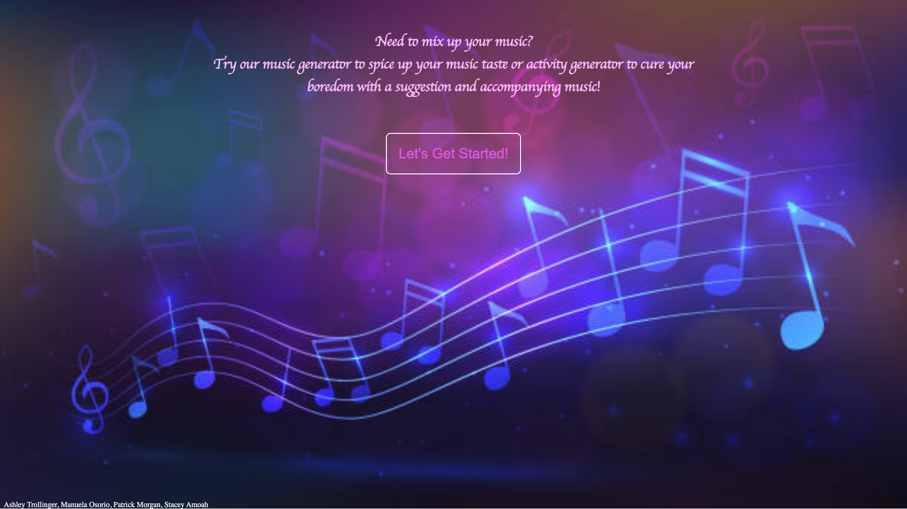
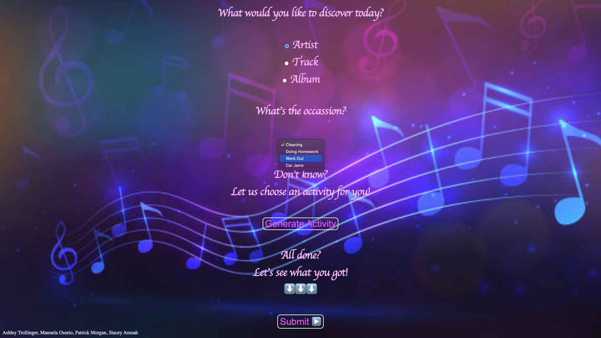
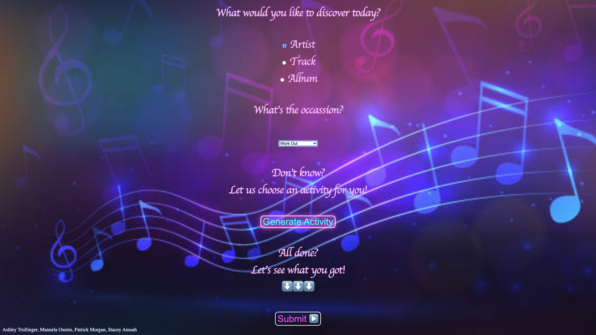
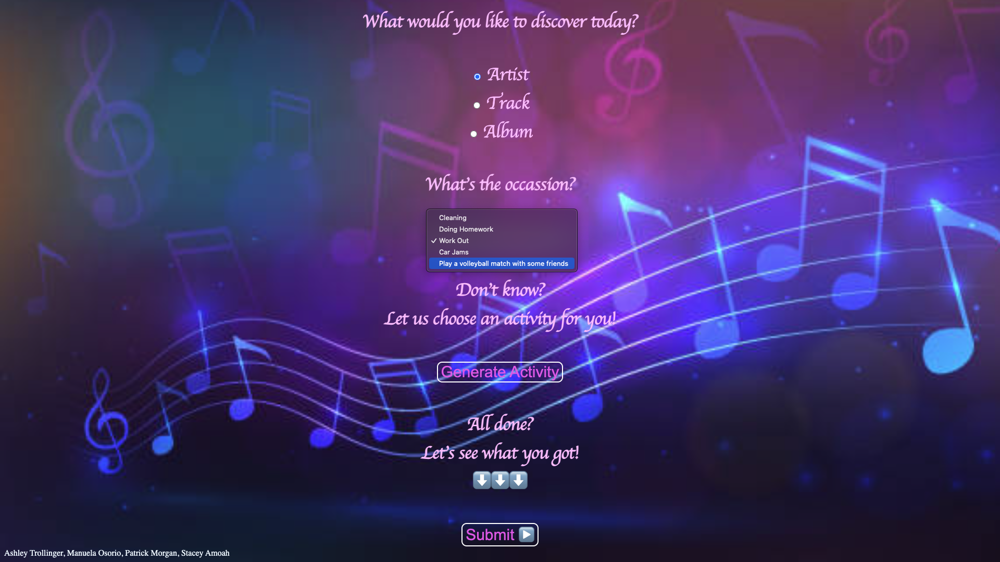
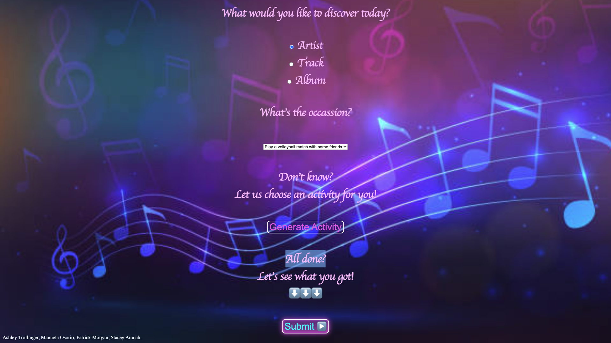
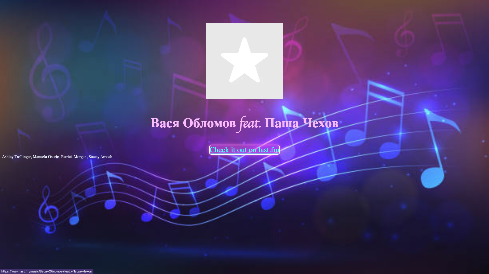

# Project 1: Mystery Melody

## Description
Introducing a new way to enhance your daily routine with music! Our website takes your choice of activity and suggests the perfect artist, album, or song to listen to while you're doing it. Whether you're going for a run, cooking dinner, or just hanging out at home, we'll provide the perfect soundtrack to complement your experience. And if you're feeling indecisive, we'll generate an activity and a song artist or album for you to try out. Say goodbye to mindlessly scrolling through your music library and hello to a personalized and enjoyable experience with every activity. Try it out now and feel the difference music can make!

## Installation

N/A

## Usage

Link to the live page here: https://jrocksymphonia.github.io/project-1/

 

## Credits

### Links of reference:

BoredAPI documentation
https://www.boredapi.com/documentation 

last.fm API documentation
https://www.last.fm/api/authentication 

last.fm API methods using tags
Get album: https://www.last.fm/api/show/tag.getTopAlbums
Get artist: https://www.last.fm/api/show/tag.getTopArtists
Get track: https://www.last.fm/api/show/tag.getTopTracks

## License
Please refer to the LICENSE in the repo.

---
